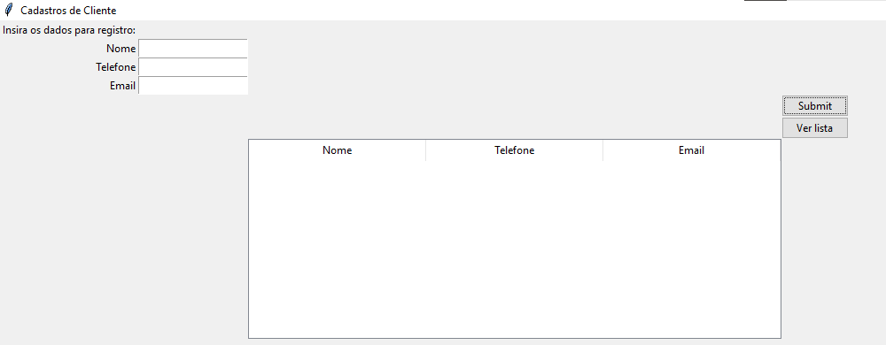
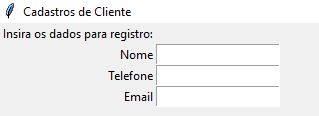
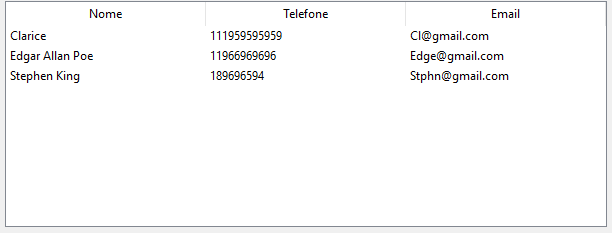
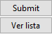

# Sistema de cadastramento de usuário
### Aplicação desktop dedicada a cadastramento e listagem de clientes, utilizando a bibilioteca tkinter.
## 📝 Descrição
#### Permite ao usuário realizar o cadastramento clientes através de uma interface gráfica simples além de poder realizar consulta aos cadastros realizados.

## Bibliotecas utilizadas

- **Tkinter**
   - **ttk**: Submodulo da bibilioteca tkinter
- **Sqlite3**: Utilizado para armazenar as informações em um banco de dados local

## 🖥️interface
#### Visão geral da página

**Campo de inserção de dados**

##### Permite a inserção manual de dados pelo usuário 

**Treeview**

##### Exibe os dados de maneira tabular, separando-os por colunas.

**Botôes interativos**

- **Submit**: Transfere os dados inseridos nas caixas de entrada para o banco de dados.
- **Ver Lista**: Exibe todos os itens registrados na tabela Treeview.
